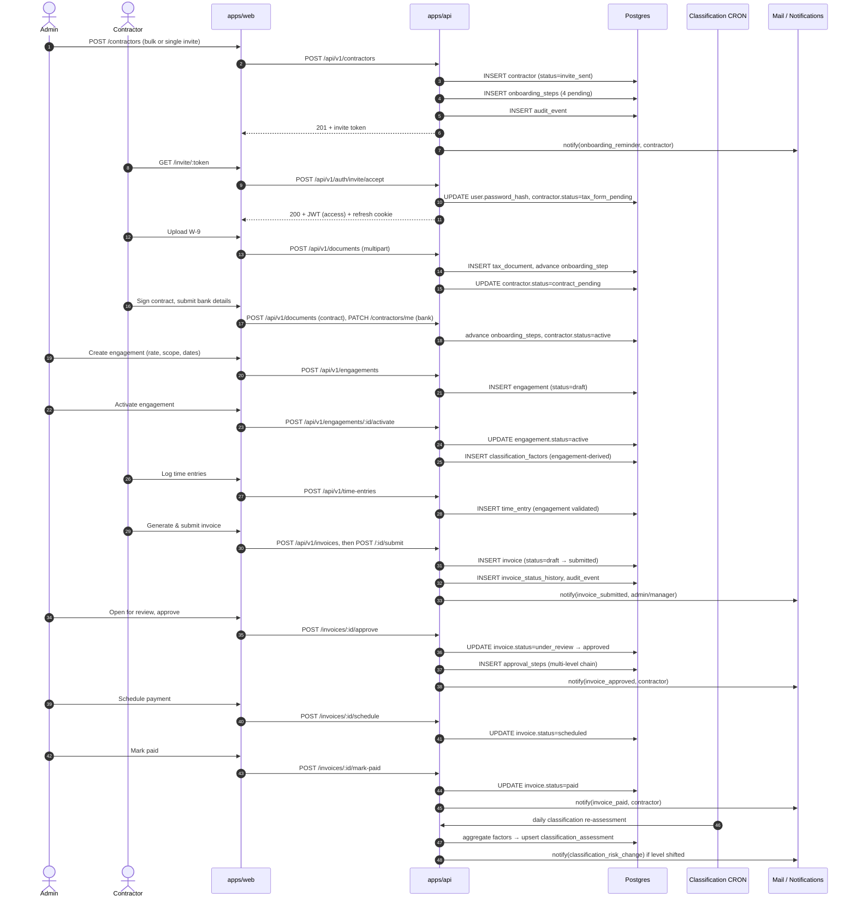

# Test Plan — Contractor Onboarding to First Paid Invoice

## 1. Why This Workflow

ContractorOS describes itself as a "unified contractor lifecycle platform." The single workflow that exercises the largest share of the platform is the one that takes a brand-new contractor from invitation through to their first paid invoice. Every other workflow either feeds this one (compliance documents, classification scoring) or follows from it (offboarding, audit, reporting).

Picking this workflow gives us coverage of the maximum number of cross-cutting concerns in a single end-to-end story:

- **Authentication & authorisation** — JWT issuance for the admin who invites, invite-token acceptance for the contractor, refresh-token rotation across long sessions, and the `JwtAuthGuard → RolesGuard → OrganizationGuard` chain.
- **Multi-tenancy** — every query must respect the `organization_id` boundary; the workflow must never let one org observe another's data.
- **Two state machines** — the 7-state contractor status machine (`invite_sent → tax_form_pending → contract_pending → bank_details_pending → active`) and the 9-state invoice machine (`draft → submitted → under_review → approved → scheduled → paid`).
- **Engagements & time entries** — the bridge between an "active" contractor and an invoiceable amount.
- **Approval routing** — multi-level approval steps on the invoice.
- **Classification risk scoring** — the daily CRON consumes engagement-derived factors and produces an IRS / DOL / ABC weighted score that gates manual review.
- **Document vault** — W-9 / contract / bank-details uploads happen inside the onboarding state transitions.
- **Audit interceptor** — every state-changing call must produce an audit-log row with old + new values.
- **Notifications** — eleven event types fire across this single flow (`onboarding_reminder`, `invoice_submitted`, `invoice_approved`, `invoice_paid`, etc.).

A test plan that covers this flow well also covers the modules underneath. Other plans (offboarding, compliance reporting) will be added later but are out of scope here.

> **Note on terminology.** "Workflow" in this document is a user-facing story. "Scenario" is a single test case at a specific layer of the pyramid (per `TEST_STRATEGY.md`, §3).

---

## 2. Workflow Overview

---

## 3. Test Scenarios

Each scenario is mapped to a layer per the pyramid in `TEST_STRATEGY.md` §3. **Type** uses `unit | integration | contract | component | e2e`. **Priority** uses `P0` (blocks the workflow's correctness — must be in CI), `P1` (high-value but non-blocking edge), `P2` (nice-to-have, regression cushion).

### 3.1 Authentication & Invite Acceptance

| ID | Scenario | Type | Priority | Preconditions | Steps | Expected Outcome |
|---|---|---|---|---|---|---|
| AUTH-01 | Admin login returns access + refresh tokens | integration | P0 | Org A seeded with admin user `admin@a.test` | `POST /auth/login` with valid creds | 200, body has `accessToken`; `Set-Cookie: refresh=...; HttpOnly; Secure; SameSite=Strict` |
| AUTH-02 | Login with wrong password returns generic error | integration | P0 | Same as AUTH-01 | `POST /auth/login` with bad password | 401, body shape `{ error: { code: 'INVALID_CREDENTIALS' } }` (no user-enumeration leak) |
| AUTH-03 | Refresh-token rotation revokes the previous token | integration | P0 | Logged-in admin with refresh cookie `r1` | `POST /auth/refresh` (yields `r2`); `POST /auth/refresh` again with `r1` | First call 200; second call 401 with `TOKEN_REVOKED` |
| AUTH-04 | Expired access token returns 401 with refresh hint | integration | P0 | Access token TTL set to 1s in test env | Wait 2s, hit any protected route | 401, header `WWW-Authenticate: Bearer error="invalid_token"` |
| AUTH-05 | Invite token validates and issues credentials | integration | P0 | Contractor invited; token `t` in seed | `POST /auth/invite/accept` with `t` and chosen password | 200, contractor `status=tax_form_pending`, audit row written |
| AUTH-06 | Invite token reuse fails after first acceptance | integration | P0 | Token `t` already used | `POST /auth/invite/accept` again with `t` | 409, `INVITE_ALREADY_USED` |
| AUTH-07 | Contractor cannot hit admin-only route | integration | P0 | Contractor JWT in hand | `GET /classification/dashboard` | 403, `FORBIDDEN`; audit event records the rejection |

### 3.2 Onboarding State Machine

| ID | Scenario | Type | Priority | Preconditions | Steps | Expected Outcome |
|---|---|---|---|---|---|---|
| ONB-01 | Sequential step enforcement (skip is rejected) | unit | P0 | Onboarding service with mocked step repo | Call `advance` from `tax_form_pending` directly to `bank_details_pending` | Throws `InvalidTransitionError`; status unchanged |
| ONB-02 | Contract upload advances status correctly | integration | P0 | Contractor at `tax_form_pending` with W-9 already on file | `POST /documents` of type `contract` | Status moves to `bank_details_pending`; onboarding_step row updated |
| ONB-03 | Bank-details submit completes onboarding | integration | P0 | Contractor at `bank_details_pending` | `PATCH /contractors/me` with bank info | Status `active`; final onboarding_step `completed`; audit row written |
| ONB-04 | Concurrent step advance from two requests serialises correctly | integration | P1 | Contractor at `tax_form_pending` | Fire two parallel `POST /documents` calls | Exactly one advances the status; the other returns 409 `STATE_CONFLICT` |

### 3.3 Multi-Tenant Isolation

| ID | Scenario | Type | Priority | Preconditions | Steps | Expected Outcome |
|---|---|---|---|---|---|---|
| MT-01 | Org A admin cannot list Org B contractors | integration | P0 | Two orgs seeded | Admin A `GET /contractors` | Body excludes Org B rows; total count is Org-A-only |
| MT-02 | Org A admin gets 404 (not 403) on Org B contractor by ID | integration | P0 | Contractor `c-b1` in Org B | Admin A `GET /contractors/c-b1` | 404 (404 not 403 to prevent enumeration) |
| MT-03 | Cross-org JWT replay rejected | integration | P0 | JWT signed with Org A `orgId` claim | Use it against Org B route via tampered URL | 403; alert-worthy audit row |
| MT-04 | Contractor sees only own invoices in portal | integration | P0 | Two contractors in same org with invoices | Contractor 1 `GET /invoices` | Body excludes Contractor 2's rows |

### 3.4 Engagement & Time Entries

| ID | Scenario | Type | Priority | Preconditions | Steps | Expected Outcome |
|---|---|---|---|---|---|---|
| ENG-01 | Engagement create requires active contractor | integration | P0 | Contractor at `tax_form_pending` | `POST /engagements` for that contractor | 422, `CONTRACTOR_NOT_ACTIVE` |
| ENG-02 | Engagement state-transition validator | unit | P0 | Pure function `isValidTransition` | Try `draft → completed`, `active → cancelled`, `completed → active` | Returns `false`, `false`, `false` (only `draft → active`, `draft → cancelled`, `active → paused`, `active → completed`, `paused → active`, `paused → cancelled` are valid) |
| ENG-03 | Time entry against draft engagement is rejected | integration | P0 | Engagement in `draft` | `POST /time-entries` referencing it | 422, `ENGAGEMENT_NOT_ACTIVE` |
| ENG-04 | Time entry ownership check | integration | P0 | Engagement assigned to Contractor 1 | Contractor 2's JWT posts a time entry | 403, audit row records attempt |

### 3.5 Invoice State Machine

| ID | Scenario | Type | Priority | Preconditions | Steps | Expected Outcome |
|---|---|---|---|---|---|---|
| INV-01 | State-transition validator covers all 9 statuses | unit | P0 | Pure function | Exhaustive matrix: 9 × 9 transitions | Matches `INVOICE_TRANSITIONS` in `state-machines.ts` exactly |
| INV-02 | Submit fails on invoice with no line items | integration | P0 | Draft invoice with 0 line items | `POST /invoices/:id/submit` | 422, `INVOICE_EMPTY` |
| INV-03 | Submit transitions draft → submitted and writes history | integration | P0 | Draft invoice with ≥1 line item | `POST /invoices/:id/submit` | 200; status `submitted`; `invoice_status_history` row appended; audit row written |
| INV-04 | Approve requires `under_review` | integration | P0 | Invoice in `submitted` | `POST /invoices/:id/approve` directly | 422, `INVALID_TRANSITION` |
| INV-05 | Approve from `under_review` writes approval_steps | integration | P0 | Invoice in `under_review`; multi-level rule (≥ $5000 needs L2 approval) | `POST /invoices/:id/approve` for an L1 invoice ($1000) | 200, status `approved`, exactly one `approval_steps` row |
| INV-06 | Multi-level approval: L1 cannot approve L2-required invoice | integration | P0 | $10000 invoice in `under_review` | L1 admin `POST /approve` | 403 or 422 with `INSUFFICIENT_APPROVAL_LEVEL`; status unchanged |
| INV-07 | Reject from `under_review` is terminal | integration | P0 | Invoice in `under_review` | `POST /invoices/:id/reject` then `POST /:id/submit` | First 200; second 422 `INVALID_TRANSITION` |
| INV-08 | Schedule then mark-paid completes lifecycle | integration | P0 | Approved invoice | `POST /:id/schedule`, then `POST /:id/mark-paid` | Final status `paid`; two history rows; two audit rows; `invoice_paid` notification fired |
| INV-09 | Concurrent submit by contractor and cancel by admin | integration | P1 | Invoice in `draft` | Fire `POST /submit` and `POST /cancel` simultaneously | Exactly one wins; the loser returns 409 `STATE_CONFLICT`; final state is consistent with the winner |
| INV-10 | Duplicate-detection rejects same-period same-amount resubmission | integration | P1 | One submitted invoice for period 2026-04 | New draft for same engagement / period / amount | 422 `DUPLICATE_INVOICE` |

### 3.6 Classification Risk Scoring

| ID | Scenario | Type | Priority | Preconditions | Steps | Expected Outcome |
|---|---|---|---|---|---|---|
| CLS-01 | IRS scorer: every factor / weight combination | unit | P0 | Pure function | Exhaustive table of 10 factors × {control / no-control} × 3 groups | Matches IRS common-law expected output for each combination |
| CLS-02 | DOL scorer: economic-realities boundaries | unit | P0 | Pure function | Six factors at `low`, `med`, `high` | Aggregated score crosses `RISK_THRESHOLDS` boundaries at the documented values |
| CLS-03 | ABC scorer: any single prong failure flips to `high` | unit | P0 | Pure function | One prong `false`, two prongs `true` | Result is `high`/`critical` regardless of other prongs |
| CLS-04 | Aggregator: weighted sum (IRS 40 / DOL 30 / ABC 30) | unit | P0 | Pure function | Hand-computed expected scores | Exact match including rounding |
| CLS-05 | Daily CRON re-assesses every active contractor | integration | P0 | 3 contractors with assessments older than 24h | Trigger CRON manually via test hook | 3 new `classification_assessments` rows; old rows preserved (history); `mv_classification_risk_summary` refreshed |
| CLS-06 | Manual re-score endpoint respects RBAC | integration | P0 | Manager (not admin) JWT | `POST /classification/contractors/:id/rescore` | 403 if rule says admin-only; otherwise 200 with new assessment |

### 3.7 Documents

| ID | Scenario | Type | Priority | Preconditions | Steps | Expected Outcome |
|---|---|---|---|---|---|---|
| DOC-01 | W-9 upload validates MIME and size | integration | P0 | Authenticated contractor | `POST /documents` with 11 MB PDF | 413 `FILE_TOO_LARGE`; no row written, no file persisted |
| DOC-02 | Cross-org document download blocked | integration | P0 | Document `d-b` in Org B | Admin A `GET /documents/d-b/download` | 404 (not 403) |

### 3.8 Audit Log & Notifications

| ID | Scenario | Type | Priority | Preconditions | Steps | Expected Outcome |
|---|---|---|---|---|---|---|
| AUD-01 | Every state-changing route writes an audit row | integration | P0 | Authenticated admin | `POST /invoices/:id/approve` | `audit_events` row with `actor_id`, `entity_type='invoice'`, `action='approve'`, `old_values`, `new_values`; values captured pre-handler |
| AUD-02 | Audit-log filter respects org boundary | integration | P0 | Two orgs' audit rows in DB | Admin A `GET /audit?action=approve` | Only Org A rows returned |
| NOT-01 | Notification fan-out to admins on invoice submit | integration | P0 | Org A has 2 admins, 1 manager | Contractor submits invoice | `notifications` rows for the 2 admins + 1 manager; none for other contractors |

### 3.9 Frontend (Component & E2E)

| ID | Scenario | Type | Priority | Preconditions | Steps | Expected Outcome |
|---|---|---|---|---|---|---|
| FE-01 | Login form validation surfaces field errors | component | P0 | LoginForm component, MSW returns 400 with field errors | User submits empty form | Errors rendered with role=alert; submit button re-enabled |
| FE-02 | Invoice submit button disabled until at least one line item | component | P0 | Empty draft invoice form | User adds 0, then 1, then removes line items | Button disabled at 0, enabled at 1, disabled again at 0 |
| E2E-01 | Full happy-path: invite → onboard → engage → invoice → paid | e2e | P0 | Seeded org with admin user, no contractors | Full Cypress journey | Final state: contractor `active`, invoice `paid`, audit log shows ≥ 8 events, contractor portal shows the paid invoice |
| E2E-02 | Cross-role workflow: contractor submit, admin approve, contractor sees status | e2e | P0 | Seeded contractor at `active` with 1 engagement | Contractor logs in → submits invoice; admin logs in → approves; contractor refreshes | Status visible to contractor flips through `submitted → approved`; notification appears |
| E2E-03 | Accessibility scan on the onboarding pipeline page | e2e | P0 | Seeded admin | Visit `/onboarding`; run cypress-axe | Zero new WCAG 2.1 AA violations |

### 3.10 Contract (Pact)

| ID | Scenario | Type | Priority | Preconditions | Steps | Expected Outcome |
|---|---|---|---|---|---|---|
| PACT-01 | Web consumer ↔ api provider on `POST /auth/login` | contract | P0 | Pact mock provider | Consumer test posts valid + invalid credentials | Pact file generated; provider verification passes against the running api |
| PACT-02 | Web consumer ↔ api provider on `POST /invoices` and `POST /invoices/:id/submit` | contract | P0 | Pact mock provider | Consumer tests both routes including 422 path for empty line items | Pact file covers happy + 422 + 409; provider verification passes |

---

## 4. Test Data Strategy

### 4.1 Seed data

- A single, deterministic seed script (`pnpm --filter @contractor-os/api seed`) produces a known-good baseline used by **every** test layer. Integration suites build on this baseline; E2E suites run against a fresh seeded DB at the start of each Cypress run.
- Two organisations are seeded so multi-tenancy isolation tests have something to compare against.
- Each org gets at least: 1 admin, 1 manager, 5 contractors spanning every onboarding status, 2 active engagements, 4 invoices spanning every invoice status, 2 documents per contractor, 1 active offboarding workflow.

### 4.2 PII handling

- All seed data is **synthetic**. Email addresses use the reserved `*.test` TLD per RFC 6761. Phone numbers use the `555` prefix. Names are drawn from a fixed list of obviously fictional combinations.
- No production data is ever copied into a test environment, even with masking. Tests that need realistic distributions use generated fixtures with the same statistical properties, not real records.
- Document uploads in tests use checked-in fixtures under `apps/api/test/fixtures/` (a 1 KB sample W-9 PDF, a sample contract PDF). Fixtures are reviewed for accidental PII before merge.

### 4.3 Test isolation & teardown

- **Unit / component**: no DB. State is owned by each test.
- **Integration**: each test runs inside a Postgres transaction opened in `beforeEach` and rolled back in `afterEach`. Suites that exercise transaction boundaries (e.g. concurrent state-machine tests) drop and re-create the schema between groups.
- **E2E**: a single seeded DB per Cypress run. Tests are designed to be order-independent — each test sets up the entities it needs by calling the api, never by mutating the DB directly.
- **Time**: tests that depend on `Date.now()` use `jest.useFakeTimers()` (api) or `vi.useFakeTimers()` (web/shared). A test that needs real wall-clock time states why in a comment.
- **Containers**: `@testcontainers/postgresql` reuses a single container per Jest project via the singleton helper, so startup cost is paid once per CI run.

---

## 5. Environment Strategy

| Environment | Composition | Used By |
|---|---|---|
| **Local dev** | Long-running Postgres on `localhost:5432`, dev seed, hot-reload api + web | Manual exploration only — never asserted on by automated tests |
| **Per-suite Testcontainers Postgres** | Ephemeral Postgres 16 container, schema migrated and seeded at suite start, torn down at suite end | All api integration tests |
| **CI Postgres service** | `services: postgres:16` in GitHub Actions, single instance per workflow run, schema migrated and seeded once | E2E + db-migrate-check jobs |
| **Performance environment** | Dedicated VM with the same Postgres major version and known-fixed seed | Nightly k6 runs |
| **Staging / production** | Out of scope for automated functional tests. Used only for read-only synthetic monitoring and post-deploy smoke. | n/a |

### Mocked external dependencies

- **Mail / outbound notifications**: api uses an in-process fake transport in tests; we assert on what would have been sent, not on live SMTP.
- **File storage**: `LocalFileStorageService` writes to a temp directory under the test container; assertions read it back. The interface allows a future S3-backed implementation to be swapped in production without test changes.
- **Time / clock**: faked at the test boundary (see §4.3).
- **No third-party paid services are exercised** — Snyk and Pact Broker are only hit in CI with secrets, never from local tests.

---

## 6. Risk Areas and Coverage Mapping

The five highest-impact failure modes for this workflow, ranked by blast radius. Each is mapped to the scenarios that cover it.

| Rank | Risk | Why It Matters | Covering Scenarios |
|---:|---|---|---|
| 1 | **Multi-tenant data leak** | One org seeing another org's invoices/contractors is a regulatory and reputational breach. | MT-01, MT-02, MT-03, MT-04, AUD-02, DOC-02 |
| 2 | **Invalid state-machine transitions allowed in production** | A bypassed transition (e.g. paying a rejected invoice) is hard to reverse and costs real money. | INV-01, INV-04, INV-07, INV-09, ONB-01, ONB-04, ENG-02 |
| 3 | **Misclassification leading to legal exposure** | The classification scorer drives the platform's headline value proposition; a wrong score can be cited in litigation. | CLS-01, CLS-02, CLS-03, CLS-04, CLS-05 |
| 4 | **Auth bypass (privilege escalation, token replay)** | A contractor accessing admin routes, or a refresh-token reuse, breaches every other guarantee on this list. | AUTH-01..AUTH-07, MT-03, ENG-04, CLS-06 |
| 5 | **Audit-log gaps on state-changing operations** | An action without an audit row defeats every compliance / dispute-handling story the product makes. | AUD-01, INV-03, INV-08, ONB-03 |

P0 scenarios are the floor — they must be in CI before this workflow is considered covered. P1 scenarios add cushion for known edge cases. P2 (none in this iteration) would be added when regression risk warrants.

---

## 7. Out of Scope

This plan deliberately does **not** cover the following — they will be addressed in their own plans.

- **Offboarding** end-to-end (5-state machine, 9-item checklist, equipment return).
- **Compliance reporting** (1099 readiness, document expiry alerts, year-over-year exports).
- **Bulk operations** (CSV import of contractors, bulk invite by spreadsheet).
- **Static marketing pages** (`/about`, `/blog`, `/careers`, etc.).
- **Performance tuning** of the classification CRON beyond the latency budgets in `TEST_STRATEGY.md` §6.
- **Disaster recovery / backup-restore** drills.
- **SDK / public API consumer testing** — the api currently has no external consumers beyond `apps/web`.
- **Mobile / responsive layouts** — covered by the design system and visual regression, not this functional plan.

A scenario falling into one of these areas is not a defect of this plan; it belongs in the right plan.
